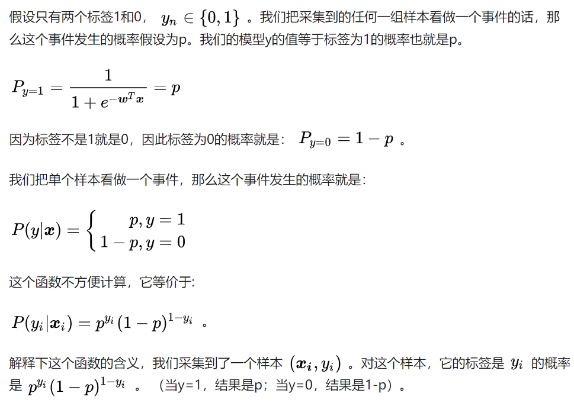
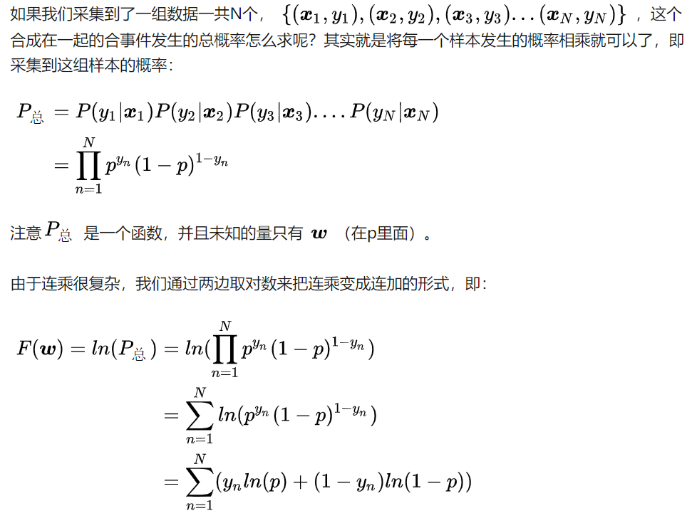
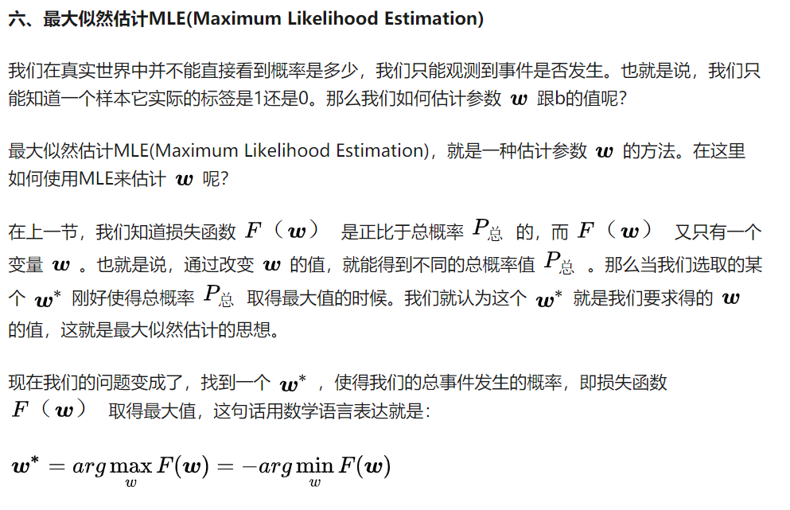
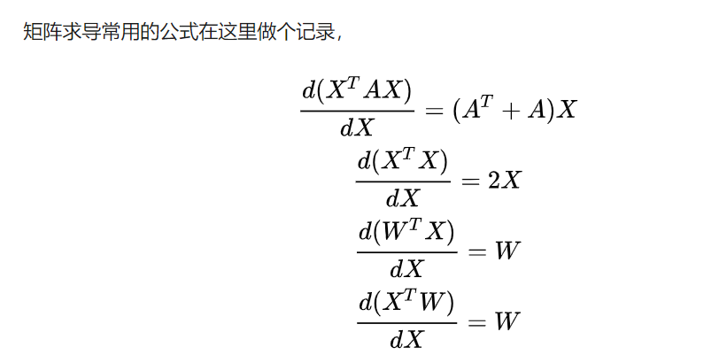
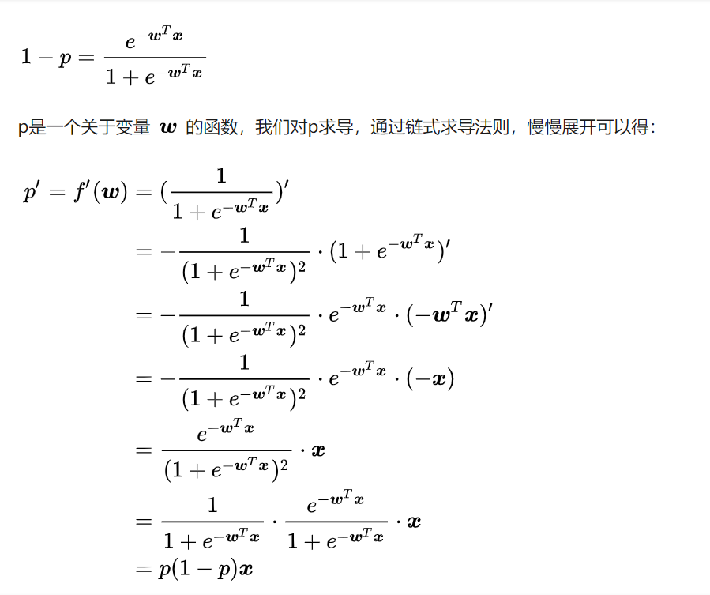
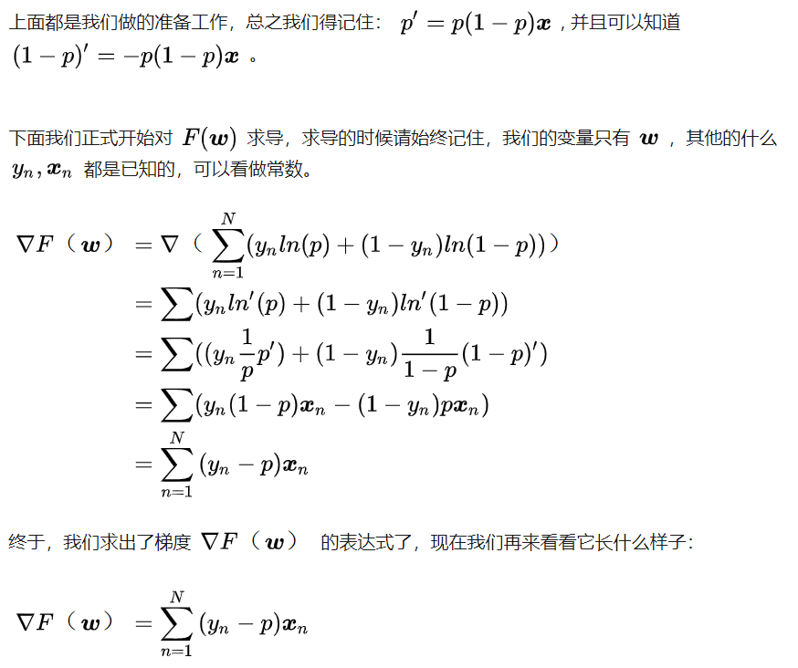
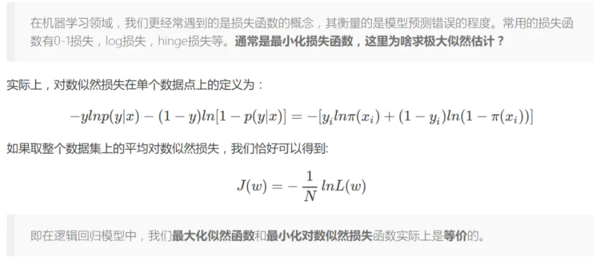
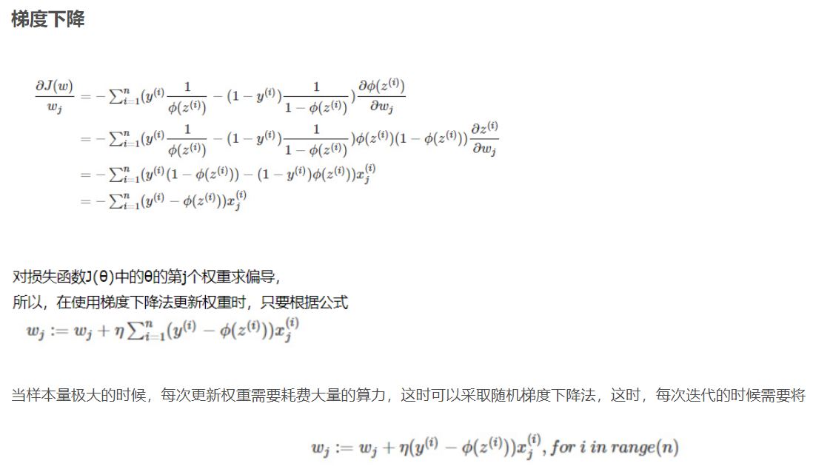

## 前言

这里面其实包含了5个点:\
1:逻辑回归的假设.\
2:逻辑回归的损失函数.\
3:逻辑回归的求解方法.\
4:逻辑回归的目的.\
5:逻辑回归如何分类.

###1.逻辑回归的假设
逻辑回归是假设数据服从独立且服从伯努利分布，多用于二分类场景，应用极大似然估计构造损失函数，并使用梯度下降法对参数进行估计.

假设只有两个标签1和0. 我们把采集到的任何一组样本看做一个事件的话，那么这个事件发生的概率假设为p.
我们的模型y的值等于标签为1的概率也就是p.\
$$P(y_{i}|x_{i})=p^{y_{i}}(1-p)^{1-y_{i}}$$

###2.逻辑回归的损失函数

####2.1 LR 损失函数为什么用极大似然函数？
*想要让每一个样本的预测都要得到最大的概率，即将所有的样本预测后的概率进行相乘都最大，也就是极大似然函数.
 
*对极大似然函数取对数以后相当于对数损失函数，由梯度更新的公式可以看出，对数损失函数的训练求解参数的速度是比较快的，而且更新速度只和x，y有关，比较的稳定.

####2.2为什么不用平方损失函数?
*如果使用平方损失函数，梯度更新的速度会和 sigmod 函数的梯度相关，sigmod 函数在定义域内的梯度都不大于0.25，导致训练速度会非常慢.
而且平方损失会导致损失函数是 \theta 的非凸函数，不利于求解，因为非凸函数存在很多局部最优解.

*最大化似然函数和最小化对数似然损失函数实际上是等价的.

####2.3损失函数推导过程
连乘是没有办法求导的或者求导困难，一般都是利用log函数转化为和的形式
###

###3.逻辑回归的求解方法

###4.逻辑回归的目的
*该函数的目的便是将数据二分类，提高准确率.

*逻辑回归作为一个回归(也就是y值是连续的)，如何应用到分类上去呢？
y值确实是一个连续的变量.逻辑回归的做法是划定一个阈值，y值大于这个阈值的是一类，y值小于这个阈值的是另外一类.阈值具体如何调整根据实际情况选择.一般会选择0.5做为阈值来划分.

###5.逻辑回归的优缺点
####优点：

*形式简单，模型的可解释性非常好。从特征的权重可以看到不同的特征对最后结果的影响，某个特征的权重值比较高，那么这个特征最后对结果的影响会比较大。

*模型效果不错。在工程上是可以接受的（作为baseline)，如果特征工程做的好，效果不会太差，并且特征工程可以大家并行开发，大大加快开发的速度。

*训练速度较快。分类的时候，计算量仅仅只和特征的数目相关。并且逻辑回归的分布式优化sgd发展比较成熟，训练的速度可以通过堆机器进一步提高，这样我们可以在短时间内迭代好几个版本的模型。

*资源占用小,尤其是内存。因为只需要存储各个维度的特征值，。

*方便输出结果调整。逻辑回归可以很方便的得到最后的分类结果，因为输出的是每个样本的概率分数，我们可以很容易的对这些概率分数进行cutoff，也就是划分阈值(大于某个阈值的是一类，小于某个阈值的是一类)。

####缺点:

*准确率并不是很高。因为形式非常的简单(非常类似线性模型)，很难去拟合数据的真实分布。

*很难处理数据不平衡的问题。举个例子：如果我们对于一个正负样本非常不平衡的问题比如正负样本比 10000:1.我们把所有样本都预测为正也能使损失函数的值比较小。但是作为一个分类器，它对正负样本的区分能力不会很好。

*处理非线性数据较麻烦。逻辑回归在不引入其他方法的情况下，只能处理线性可分的数据，或者进一步说，处理二分类的问题 。

*逻辑回归本身无法筛选特征。有时候，我们会用gbdt来筛选特征，然后再上逻辑回归。

##手推lr梯度, 交叉熵损失为什么有log项？

