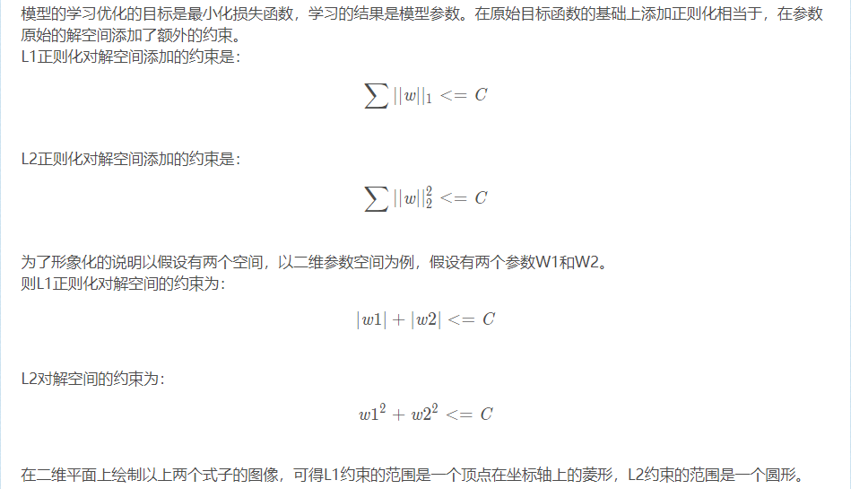
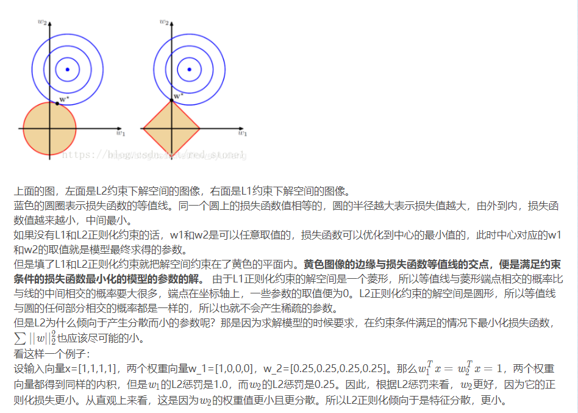

##1.正则化的作用
####1.1 正则化的主要作用是防止过拟合.
- 对模型添加正则化项可以限制模型的复杂度，使得模型在复杂度和性能达到平衡。
常用的正则化方法有L1正则化和L2正则化。
L1正则化和L2正则化可以看做是损失函数的惩罚项。
所谓『惩罚』是指对损失函数中的某些参数做一些限制。
 L1正则化的模型建叫做Lasso回归，使用L2正则化的模型叫做Ridge回归（岭回归）。
 
##
####1.2 李飞飞在CS2312中给的更为详细的解释：

- L2正则化可以直观理解为它对于大数值的权重向量进行严厉惩罚，倾向于更加分散的权重向量。
  由于输入和权重之间的乘法操作，这样就有了一个优良的特性：使网络更倾向于使用所有输入特征，
  而不是严重依赖输入特征中某些小部分特征。 L2惩罚倾向于更小更分散的权重向量，
  这就会鼓励分类器最终将所有维度上的特征都用起来，而不是强烈依赖其中少数几个维度。
  这样做可以提高模型的泛化能力，降低过拟合的风险。
  
- L1正则化有一个有趣的性质，它会让权重向量在最优化的过程中变得稀疏（即非常接近0）。
  也就是说，使用L1正则化的神经元最后使用的是它们最重要的输入数据的稀疏子集，
  同时对于噪音输入则几乎是不变的了。相较L1正则化，L2正则化中的权重向量大多是分散的小数字。
  
- L1正则化可以产生稀疏权值矩阵，即产生一个稀疏模型，可以用于特征选择。
  
- 在实践中，如果不是特别关注某些明确的特征选择，一般说来L2正则化都会比L1正则化效果好。
  L2正则化可以防止模型过拟合（overfitting）；一定程度上，L1也可以防止过拟合
  
####1.3 稀疏模型与特征选择
上面提到L1正则化有助于生成一个稀疏权值矩阵，
进而可以用于特征选择。为什么要生成一个稀疏矩阵？

`稀疏矩阵指的是很多元素为0，只有少数元素是非零值的矩阵，
即得到的线性回归模型的大部分系数都是0. 
通常机器学习中特征数量很多，例如文本处理时，如果将一个词组（term）作为一个特征，
那么特征数量会达到上万个（bigram）。在预测或分类时，那么多特征显然难以选择，
但是如果代入这些特征得到的模型是一个稀疏模型，表示只有少数特征对这个模型有贡献，
绝大部分特征是没有贡献的，或者贡献微小（因为它们前面的系数是0或者是很小的值，
即使去掉对模型也没有什么影响），此时我们就可以只关注系数是非零值的特征。
这就是稀疏模型与特征选择的关系。`

##2.正则化的原理

####2.1  为什么参数越小代表模型越简单？

- 越是复杂的模型，越是尝试对所有样本进行拟合，包括异常点。这就会造成在较小的区间中产生较大的波动，这个较大的波动也会反映在这个区间的导数比较大。

- 只有越大的参数才可能产生较大的导数。因此参数越小，模型就越简单。

####2.2  实现参数的稀疏有什么好处？

- 因为参数的稀疏，在一定程度上实现了特征的选择。一般而言，大部分特征对模型是没有贡献的。这些没有用的特征虽然可以减少训练集上的误差，但是对测试集的样本，反而会产生干扰。稀疏参数的引入，可以将那些无用的特征的权重置为0.

##3.总结
- 添加正则化相当于参数的解空间添加了约束，限制了模型的复杂度
- L1正则化的形式是添加参数的绝对值之和作为结构风险项，L2正则化的形式添加参数的平方和作为结构风险项
- L1正则化鼓励产生稀疏的权重，即使得一部分权重为0，用于特征选择；L2鼓励产生小而分散的权重，鼓励让模型做决策的时候考虑更多的特征，而不是仅仅依赖强依赖某几个特征，可以增强模型的泛化能力，防止过拟合。
- 正则化参数 λ越大，约束越严格，太大容易产生欠拟合。正则化参数 λ越小，约束宽松，太小起不到约束作用，容易产生过拟合。
- 如果不是为了进行特征选择，一般使用L2正则化模型效果更好。