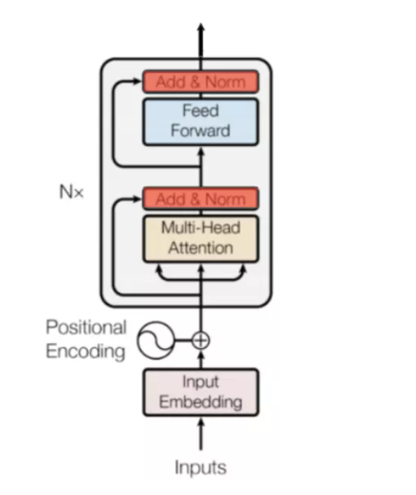

#### Bert 模型结构图


#### 第一部分：Bert Embedding
```python
class BERTEmbedding(nn.Module):

	Bert Embedding 由三部分组成，
	TokenEmbedding是单词embedding的结果，
	PositionalEmbedding是位置编码，用sin、cos公式计算
	SegmentEmbedding是用来区分段落的（不知道为什么初始化词向量是词表大小为3）

	def __init__(self,vocab_size,embed_size,dropout=0.1):
		super().__init__()
		self.token=TokenEmbedding(vocab_size=vocab_size,embed_size=embed_size)
		self.position=PositionalEmbedding(d_model=self.token.embedding_dim)
		self.segment=SegmentEmbedding(embed_size=self.token.embedding_size)
		self.dropout=nn.Dropout(p=dropout)
		self.embed_size=embed_size

	def forward(self,sequence,segment_label):
		x=self.token(sequence)+self.position(sequence)+self.segment(segment_label)
		return self.dropout(x)
```

#### 第二部分: Mutil-Head Attention

##### Attention操作
```python
class Attention(nn.Module):
	"""
	Computed Scaled Dot Product Attention 
	
	与MultiHeadedAttention最大的不同：self-attention中没有需要学习的参数，纯粹就是矩阵相乘！！！

	torch.mm 是二维张量相乘
	torch.bmm是三维张量相乘
	torch.matmul是高维张量相乘
	"""

	def forward(self,query,key,value,mask=None,dropout=None):
		"""
		q*k/sqrt(q.size(-1))   假设q、k的是维度为1*64的列向量，那么sqrt(q.size(-1))=8
		这样做的目的是使模型在训练过程中具有更加稳定的梯度 /sqrt(q.size(-1)) 并不是唯一选择，经验所得
		假设词向量为512，那么经过 W_q、W_k、W_v三个矩阵的变换可以得到 q、k、v，分别是64维，目的是将来使
		Mutil-head Attention的输出拼接到一起后恢复为512维，Transformer使用8个attention heads   64*8=512
		"""
		
		scores=torch.matmul(query,key.transpose(-2,-1))/math.sqrt(query.size(-1)) 
		if mask is not None:
			score=scores.masked_fill(mask==0,-1e9)

		"""
		假设score 得到了112、96,直接去计算softmax计算量会很大，通过缩放可以减小计算量，同时如果不缩放会使神经元陷入饱和区，梯度更新太小
		计算softmax的时候，是 (e^a)/(e^a+e^b+e^c...)，利用masked_fill使mask为0的地方为负无穷，就可以保证将来softmax后的权重接近0
		"""

		p_attn=F.softmax(score,dim=-1)

		if dropout is not None:
			p_attn=dropout(p_attn)

		return torch.matmul(p_attn,value),p_attn
"""
由于scaled_dot_product_attention是self-attention中的一种，可以通过把所有的query拼成一个矩阵，与key拼接成的矩阵相乘，得到softmax的矩阵，
然后再与value构成的矩阵相乘，就可以得到self-attention的计算结果，所以self-attention 是通过并行计算完成的
"""
```


##### Mutil-head Attention
```python 
 
#理解了 Scaled dot-product attention，Multi-head attention 也很容易理解啦。
#论文提到，他们发现将 Q、K、V 通过一个线性映射之后，分成 h 份，
#对每一份进行 scaled dot-product attention 效果更好。然后，
#把各个部分的结果合并起来，再次经过线性映射，得到最终的输出。
#这就是所谓的 multi-head attention。 
 
class MultiHeadedAttention(nn.Module): 
	初始化时需要定义 “头数” 和模型尺寸 

	def __init__(self,h,d_model,dropout=0.1):
		super().__init__()

		assert d_model%h==0  

		模型的维度需要能够整除 “头数”，例如query为512维，经过线性映射后还是512维，多头数为8，那么每个头的维度为512/8=64
		多头attention就是将 512维的 Q\\W\\V矩阵经过线形变换，然后512维的列向量拆分成8个64维的列向量，最终每个头再经过
		scaled_dot_product_attention计算得到各自的 八个 V'，然后concat到一起又恢复为512维，所以Transformer输入输出维度相等
 
		self.d_k=d_model//h
		self.h=h

		self.linear_layers=nn.Modulelist([nn.Linear(d_model,d_model) for _ in range(3)])
		self.output_layer=nn.Linear(d_model,d_model)
		self.attention=Attention()

		self.dropout=nn.Dropout(p=dropout)

	def forward(self,query,key,value,mask=None):

		batch_size=query.size(0)

		#d_model=d_k*h

		query,key,value=[l(x).view(batch_size,-1,self.h,self.d_k).transpose(1,2) for l,x in zip(self.linear_layers,(query,key,value)) ]

		x,atten=self.attention(query,key,value,mask=mask,dropout=self.dropout)

		x=x.transpose(1,2).contiguous().view(batch_size,-1,self.h*self.d_k)

		return self.output_layer(x)
```


#### 第三部分：Bert 残差连接机制

##### 残差连接
```python
class SublayerConnection(nn.Module):
	def __init__(self,size,dropout):
		super(SublayerConnection,self).__init__()
		self.norm=LayerNorm(size)
		self.dropout=nn.Dropout(dropout)

	def forward(self,x,sublayer):
		return x+self.dropout(sublayer(self.norm(x)))
```
##### Layer Norm 归一化
```python  
class LayerNorm(nn.Module):
	def __init__(self,features,eps=1e-6):
		super(LayerNorm,self).__init__()
		self.a_2=nn.Parameter(torch.ones(features))
		self.b_2=nn.Parameter(torch.zeros(features))
		self.eps=eps

	def forward(self,x):
		mean=x.mean(-1,keepdim=True)
		std=x.std(-1,keepdim=True)
		return self.a_2*(x-mean)/(std+self.eps)+self.b_2 
```

#### 第四部分：Feed-Forward前馈网络
```python
"""
Transformer Encoder由 6 层相同的层组成，每一层分别由两部分组成：
第一部分是 multi-head self-attention （残差连接+归一化）
第二部分是 position-wise feed-forward network，是一个全连接层 （残差连接+归一化）

embedding后经过位置编码，经过一个Multi-Head Attention，然后残差相加归一化，然后经过一个FeedForward全连接层
然后残差相加归一化，这就是Encoder的全部组成。
事实上，Transformer编码器中没有self-attention模块，只有Multi-Head Attention模块，而Multi-Head Attention
内部计算就是多个self-attention而已，其中self-attention是纯粹的矩阵相乘，没有任何需要学习的参数

先将512的向量利用全连接层升维2048，再利用全连接层降回512维，
或者也可以用两个卷积核大小为1的卷积来实现
"""
class PositionwiseFeedForward(nn.Module):
	def __init__(self,d_model,d_ff,dropout=0.1):
		super(PositionwiseFeedForward,self).__init__()

		self.w_1=nn.Linear(d_model,d_ff)
		self.w_2=nn.Linear(d_ff,d_model)
		self.dropout=nn.Dropout(dropout)
		self.activation=GELU()
	def forward(self,x):
		return self.w_2(self.dropout(self.activation(self.w_1(x))))
```


#### 第五部分：Mask机制及两个预训练任务的数据预处理
```python
def random_word(self,sentence):
    #此函数的作用:tokens输入时是句子对应的单词列表 输出时就变成了对应的 token列表
    #           output_label就是想要得到的token列表

    tokens=sentence.split()
    output_label=[]

    #随机15%的文本被替换，被替换的位置中80%被替换为[MASK]
    #被替换位置中的10%被替换为 [RANDOM],词表中的随机一个词
    #被替换位置中的10%保持原样，但是需要预测为原词，目的是使表征偏向于实际观察到的词

    """
    这个过程的优点是，Transformer编码器不知道它将被要求预测哪些词，或者哪些词已经被随机词所取代，
    因此它被迫保留每个输入token的上下文表示。此外，由于随机替换只发生在所有标记的1.5%（即15%的10%），
    这似乎不会损害模型的语言理解能力.
    """
    for i ,token in enumerate(tokens):
        prob=random.random()
        if prob<0.15:
            prob/=0.15  #要看看prob与0.15的比例从而得到确切的概率值

            if prob<0.8:
                tokens[i]=self.vocab.mask_index

            elif prob<0.9:
                tokens[i]=random.randrange(len(self.vocab))

            else:
                #10%的概率保持原样，其目的是使表征偏向于实际观察到的词
                tokens[i]=self.vocab.stoi.get(token,self.vocab.unk_index)

            output_label.append(self.vocab.stoi.get(token,self.vocab.unk_index))

        #另外85%的单词直接将输出标签设为0，0就是padding_index对应的数字
        #后面训练计算NLLLoss时直接设置ignore_index=0,就是把label=0的位置的loss忽略
        #所以那些词的输出并不参与loss计算！！！！
        else:
            tokens[i]=self.vocab.stoi.get(token,self.vocab.unk_index)
            output_label.append(0)##0就是padding_index对应的数字

    return tokens,output_label

#构建next_sentence_predict任务的训练集
def random_sent(self,index):
    t1,t2=self.get_corpus_line(index)

    #一半概率是正例，一半概率是负例
    if random.random()>0.5:
        return t1,t2,1
    else:
        return t1,self.get_random_line(),0
```

#### 第六部分：预训练方法及语言模型
```python
"""
预测下一句这个任务就是一个二分类，将bert输出层的第一个列向量输给一个全连接层，
再加softmax就得到了这句话是下一句话的概率,x[:,0]代表输出层第一个列向量
"""

class NextSentencePrediction(n.Module):
	def __init__(self,hidden):
		super().__init__()
		self.linear=nn.Linear(hidden,2)
		self.softmax=n.LogSoftmax(dim=-1)
	def forward(self,x):
		return self.softmax(self.linear(x[:,0]))

"""
预测mask掉的词，本质上就是一个标注问题，根据当前位置bert输出的隐状态hidden，
输给一个全连接层，多分类问题，类别数就是词表大小，预测当前的词
最后接一个softmax
"""

class MaskedLanguageModel(nn.Module):
	def __init__(self,hidden,vocab_size):
		super().__init__()
		self.linear=nn.Linear(hidden,vocab_size)
		self.softmax=nn.LogSoftmax(dim=-1)
	def forward(self,x):
		return self.softmax(self.linear(x))

class BERTLM(nn.Module):
	def __init__(self,bert:BERT.vocab_size):
		super().__init__()
		self.bert=bert
		self.next_sentence=NextSentencePrediction(self.bert.hidden)
		self.mask_lm=MaskedLanguageModel(self.bert.hidden,vocab_size)

	def forward(self,x,segment_label):
		x=self.bert(x,segment_label)
		return self.next_sentence(x),self.mask_lm(x)
```