#### GPT-1
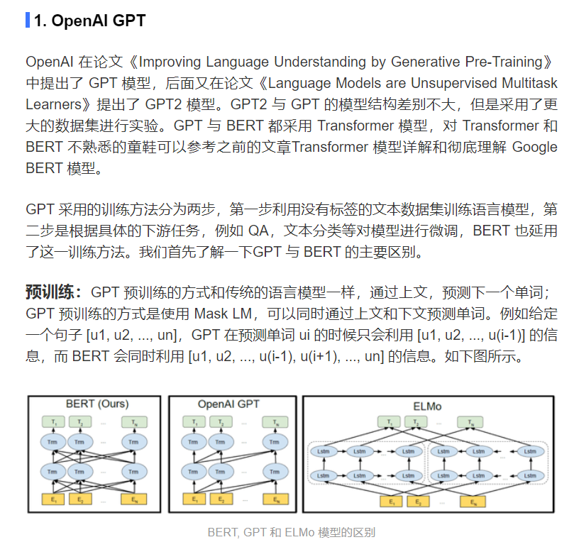
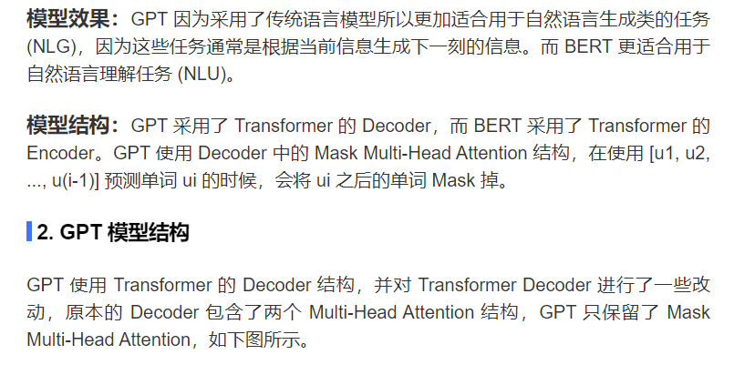
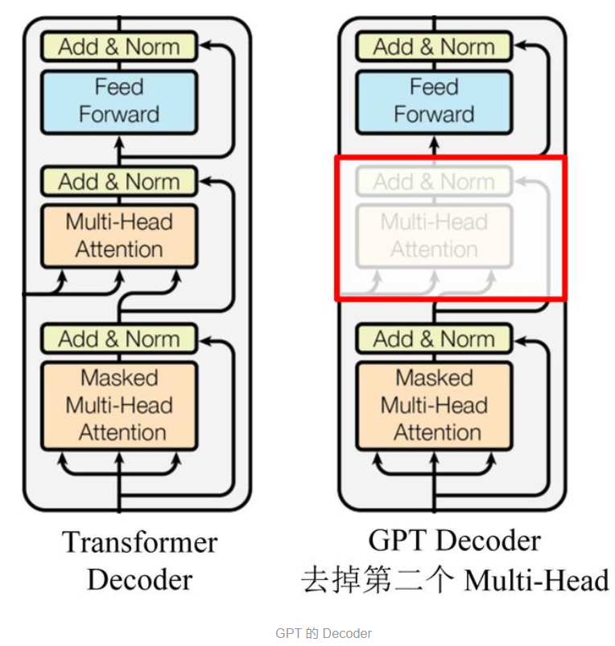
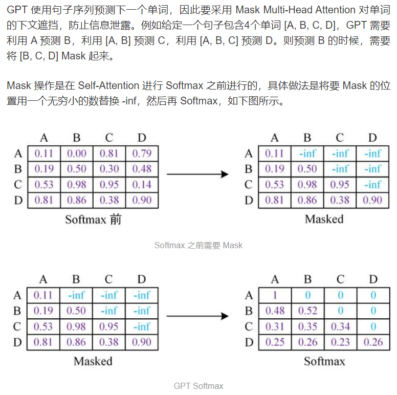

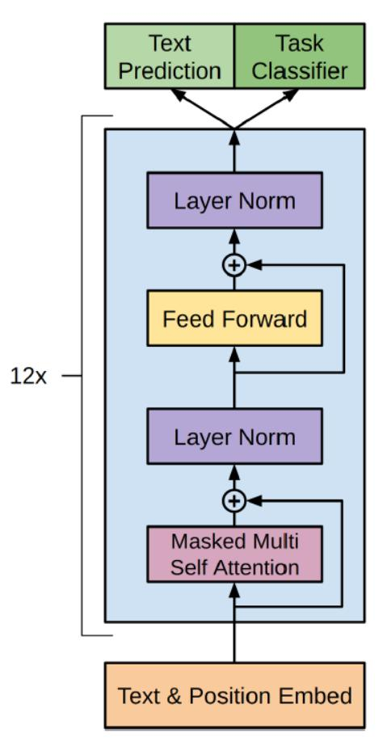
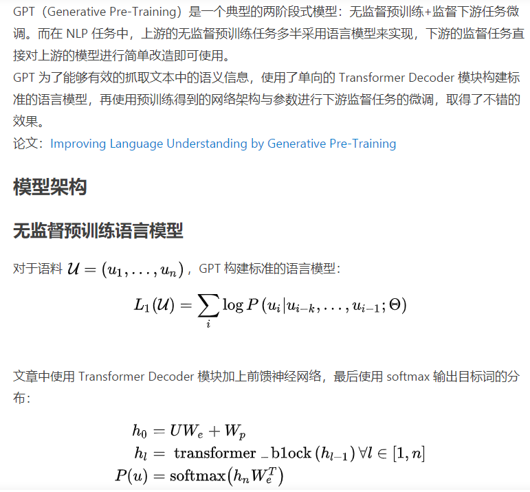
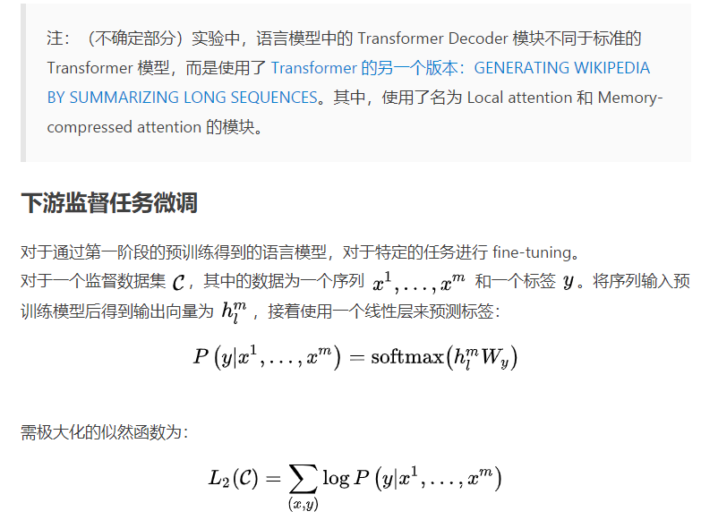
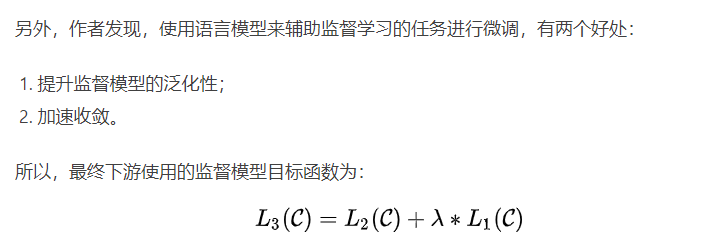
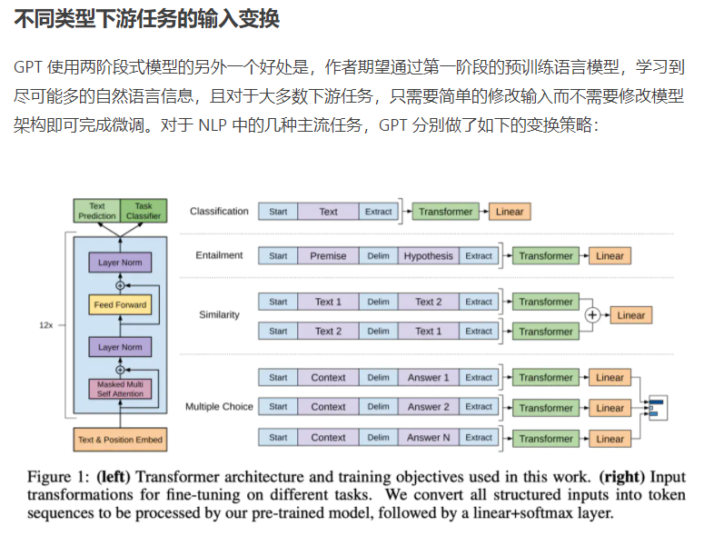

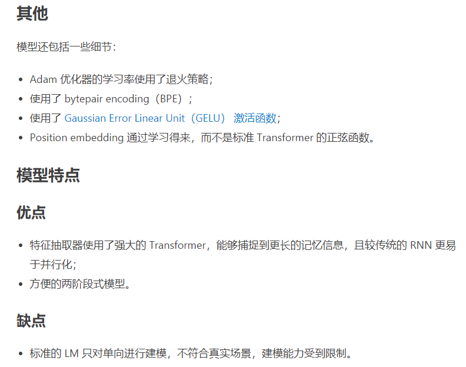
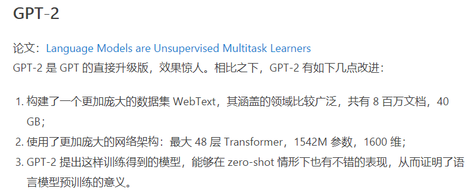

#### Transformer整体结构
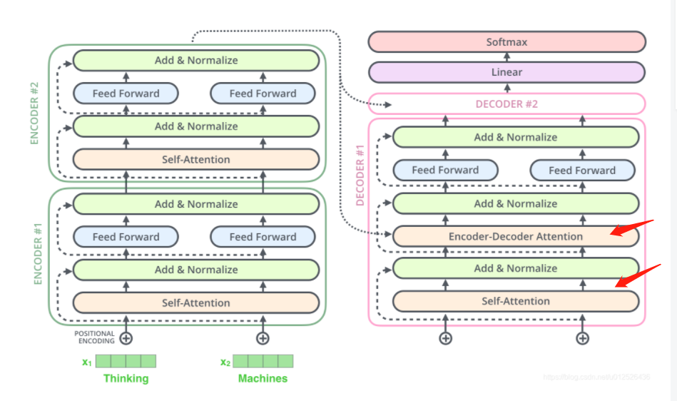
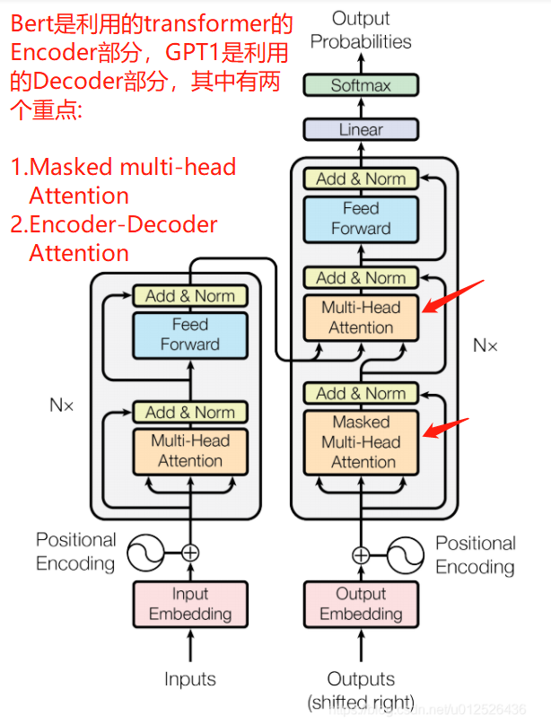

#### Transformer Decoder结构说明

##### 1.Sequence mask

sequence mask是为了使得decoder不能看见未来的信息。也就是对于一个序列，在time_step为t的时刻，我们的解码输出应该只能依赖于t时刻之前的输出，而不能依赖t之后的输出。因此我们需要想一个办法，把t之后的信息给隐藏起来。

那么具体怎么做呢？也很简单： 产生一个上三角矩阵，上三角的值全为1，下三角的值权威0，对角线也是0 。把这个矩阵作用在每一个序列上，就可以达到我们的目的啦。

具体的代码实现如下：
```python
def sequence_mask(seq):
    batch_size, seq_len = seq.size()
    mask = torch.triu(torch.ones((seq_len, seq_len), dtype=torch.uint8),
                    diagonal=1)
    mask = mask.unsqueeze(0).expand(batch_size, -1, -1)  # [B, L, L]
    return mask
```

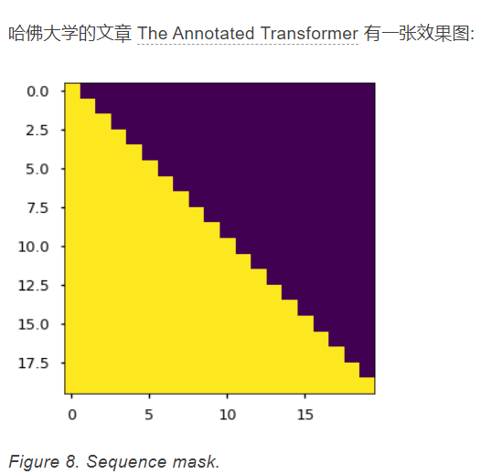
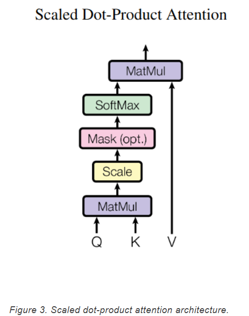


##### 2.Multi-Head Attention
```python
import torch
import torch.nn as nn


class MultiHeadAttention(nn.Module):

    def __init__(self, model_dim=512, num_heads=8, dropout=0.0):
        super(MultiHeadAttention, self).__init__()

        self.dim_per_head = model_dim // num_heads
        self.num_heads = num_heads
        self.linear_k = nn.Linear(model_dim, self.dim_per_head * num_heads)
        self.linear_v = nn.Linear(model_dim, self.dim_per_head * num_heads)
        self.linear_q = nn.Linear(model_dim, self.dim_per_head * num_heads)

        self.dot_product_attention = ScaledDotProductAttention(dropout)
        self.linear_final = nn.Linear(model_dim, model_dim)
        self.dropout = nn.Dropout(dropout)
		# multi-head attention之后需要做layer norm
        self.layer_norm = nn.LayerNorm(model_dim)

    def forward(self, key, value, query, attn_mask=None):
		# 残差连接
        residual = query

        dim_per_head = self.dim_per_head
        num_heads = self.num_heads
        batch_size = key.size(0)

        # linear projection
        key = self.linear_k(key)
        value = self.linear_v(value)
        query = self.linear_q(query)

        # split by heads
        key = key.view(batch_size * num_heads, -1, dim_per_head)
        value = value.view(batch_size * num_heads, -1, dim_per_head)
        query = query.view(batch_size * num_heads, -1, dim_per_head)

        if attn_mask:
            attn_mask = attn_mask.repeat(num_heads, 1, 1)
        # scaled dot product attention
        scale = (key.size(-1) // num_heads) ** -0.5
        context, attention = self.dot_product_attention(
          query, key, value, scale, attn_mask)

        # concat heads
        context = context.view(batch_size, -1, dim_per_head * num_heads)

        # final linear projection
        output = self.linear_final(context)

        # dropout
        output = self.dropout(output)

        # add residual and norm layer
        output = self.layer_norm(residual + output)

        return output, attention
```

##### 3.Transformer Decoder
```python
import torch
import torch.nn as nn


class DecoderLayer(nn.Module):

    def __init__(self, model_dim, num_heads=8, ffn_dim=2048, dropout=0.0):
        super(DecoderLayer, self).__init__()

        self.attention = MultiHeadAttention(model_dim, num_heads, dropout)
        self.feed_forward = PositionalWiseFeedForward(model_dim, ffn_dim, dropout)

    def forward(self,dec_inputs,enc_outputs,self_attn_mask=None,context_attn_mask=None):
        # self attention, all inputs are decoder inputs
        dec_output, self_attention = self.attention(
          dec_inputs, dec_inputs, dec_inputs, self_attn_mask)

        # context attention
        # query is decoder's outputs, key and value are encoder's inputs
        dec_output, context_attention = self.attention(
          enc_outputs, enc_outputs, dec_output, context_attn_mask)

        # decoder's output, or context
        dec_output = self.feed_forward(dec_output)

        return dec_output, self_attention, context_attention


class Decoder(nn.Module):

    def __init__(self,vocab_size,max_seq_len,num_layers=6,model_dim=512,num_heads=8,
               ffn_dim=2048,dropout=0.0):
        super(Decoder, self).__init__()

        self.num_layers = num_layers

        self.decoder_layers = nn.ModuleList(
          [DecoderLayer(model_dim, num_heads, ffn_dim, dropout) for _ in
           range(num_layers)])

        self.seq_embedding = nn.Embedding(vocab_size + 1, model_dim, padding_idx=0)
        self.pos_embedding = PositionalEncoding(model_dim, max_seq_len)

    def forward(self, inputs, inputs_len, enc_output, context_attn_mask=None):
        output = self.seq_embedding(inputs)
        output += self.pos_embedding(inputs_len)

        self_attention_padding_mask = padding_mask(inputs, inputs)
        seq_mask = sequence_mask(inputs)
        self_attn_mask = torch.gt((self_attention_padding_mask + seq_mask), 0)

        self_attentions = []
        context_attentions = []
        for decoder in self.decoder_layers:
            output, self_attn, context_attn = decoder(
            output, enc_output, self_attn_mask, context_attn_mask)
            self_attentions.append(self_attn)
            context_attentions.append(context_attn)

        return output, self_attentions, context_attentions
```

